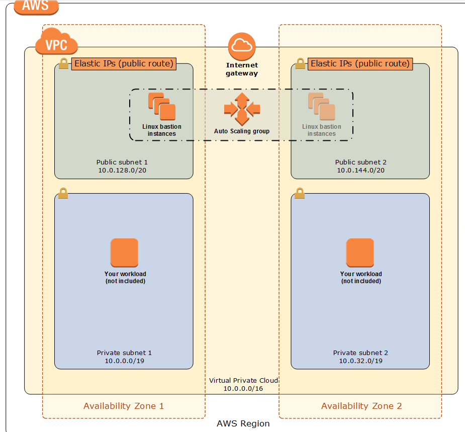

**Linux Bastion**

A highly available architecture that spans two Availability Zones.

A VPC configured with public and private subnets according to AWS best practices, to provide you with your own virtual network on AWS.

An Internet gateway to allow access to the Internet. This gateway is used by the bastion hosts to send and receive traffic.

Managed NAT gateways to allow outbound Internet access for resources in the private subnets.

A Linux bastion host in each public subnet with an Elastic IP address to allow inbound Secure Shell (SSH) access to EC2 instances in public and private subnets.

A security group for fine-grained inbound access control.

An Amazon EC2 Auto Scaling group with a configurable number of instances.

A set of Elastic IP addresses that match the number of bastion host instances. If the Auto Scaling group relaunches any instances, these addresses are reassociated with the new instances.

**Architecture Diagram**


**Execute ?**
create *terraform.tfvars* with your AWS *AWS_ACCESS_KEY= " "* and ** AWS_SECRET_KEY=" "* in this folder
create a pair of SSH key using *ssh-keygen -f mykey* 

finally, 

```
terraform init
terraform plan 
terraform apply
``